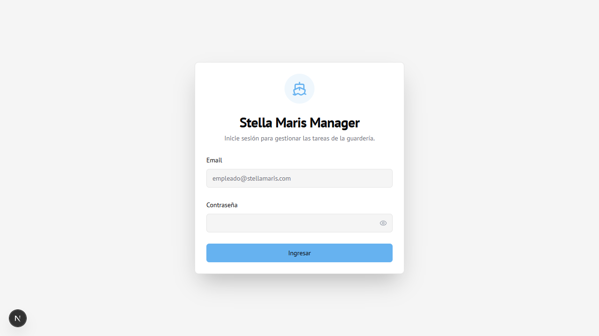

# 01 — Inicio de Sesión

← [Índice](00-indice.md) | Siguiente: [Dashboard →](02-dashboard.md)

---

## Pantalla de ingreso

Al abrir la aplicación se muestra la pantalla de login.

---

## Cómo ingresar

1. Ingresar el **Email** en el campo correspondiente
2. Ingresar la **Contraseña**
   - El ícono del ojo (👁) permite mostrar/ocultar la contraseña
3. Hacer clic en **Ingresar**

---

## Redirección según rol

| Rol | Redirige a |
|-----|-----------|
| Administrador | Dashboard |
| Empleado | Mis Tareas |

---

## Notas

- Si la sesión ya está activa al entrar a la pantalla de login, se muestra el botón **Cerrar Sesión** para cambiar de usuario.
- Si las credenciales son incorrectas, aparece un mensaje de error en rojo debajo del formulario.
- La contraseña inicial de cada empleado nuevo es: **NombreDNI** (ej: `Juan12345678`). Se recomienda cambiarla desde Configuración.
