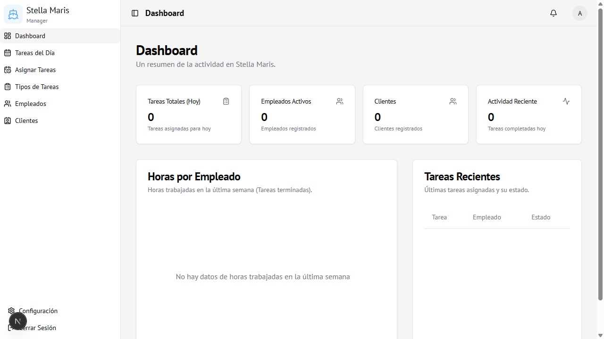

# 02 — Dashboard

← [Login](01-login.md) | [Índice](00-indice.md) | Siguiente: [Tareas del Día →](03-tareas-del-dia.md)

---

## Vista general

El Dashboard es la pantalla principal del administrador. Muestra un resumen del estado actual de la guardería.

---

## Tarjetas de métricas

En la parte superior hay 4 indicadores en tiempo real:

| Tarjeta | Muestra |
|---------|---------|
| **Tareas Totales (Hoy)** | Cantidad de tareas asignadas para el día de hoy |
| **Empleados Activos** | Total de empleados registrados en el sistema |
| **Clientes** | Total de clientes registrados |
| **Actividad Reciente** | Tareas completadas hoy |

---

## Gráfico de horas por empleado

Muestra un gráfico de barras con las horas trabajadas por cada empleado durante la **última semana**, considerando solo las tareas con estado **Completada**.

- Si no hay datos aún, se muestra el mensaje *"No hay datos de horas trabajadas en la última semana"*.
- Los empleados aparecen ordenados de mayor a menor carga horaria.

---

## Tabla de tareas recientes

Lista las últimas asignaciones creadas con:
- Nombre de la tarea
- Empleado asignado
- Estado actual (Pendiente / Aceptada / Completada / Rechazada / Cancelada)

---

## Acceso

Solo visible para usuarios con rol **Administrador**.
Ruta: `/dashboard`
