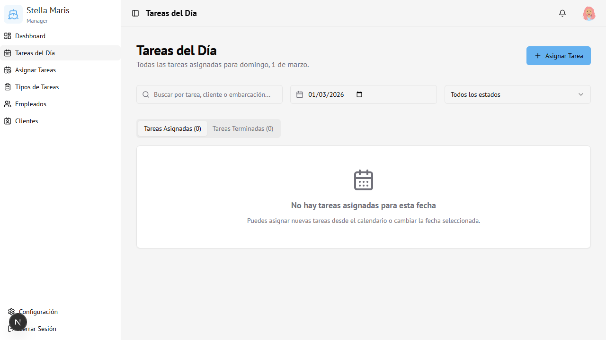

# 03 — Tareas del Día

← [Dashboard](02-dashboard.md) | [Índice](00-indice.md) | Siguiente: [Tipos de Tareas →](04-tipos-de-tareas.md)

---

## Vista general

Muestra todas las tareas asignadas para una fecha específica. Es la pantalla operativa del día a día.

---

## Controles de la pantalla

### Filtros disponibles

| Control | Función |
|---------|---------|
| **Buscador** | Filtra por nombre de tarea, cliente o embarcación |
| **Selector de fecha** | Cambia el día consultado (por defecto: hoy) |
| **Estado** | Filtra por estado: Todos, Pendiente, Aceptada, Completada, etc. |

### Pestañas

- **Tareas Asignadas** — Muestra las tareas activas (pendientes y aceptadas)
- **Tareas Terminadas** — Muestra las tareas completadas del día

---

## Asignar una tarea desde esta pantalla

1. Hacer clic en el botón **+ Asignar Tarea** (arriba a la derecha)
2. Se abre el diálogo de asignación (ver módulo [07 — Asignar Tareas](07-asignar-tareas.md))
3. La fecha se pre-completa con el día seleccionado

---

## Estados de las tareas

| Estado | Color | Descripción |
|--------|-------|-------------|
| Pendiente | Amarillo | Asignada, esperando confirmación del empleado |
| Aceptada | Azul | El empleado confirmó que la realizará |
| Completada | Verde | La tarea fue finalizada |
| Rechazada | Gris | El empleado rechazó la tarea |
| Cancelada | Rojo | La tarea fue cancelada por el administrador |

---

## Acceso

Solo visible para **Administrador** y **Encargado**.
Ruta: `/today-tasks`
