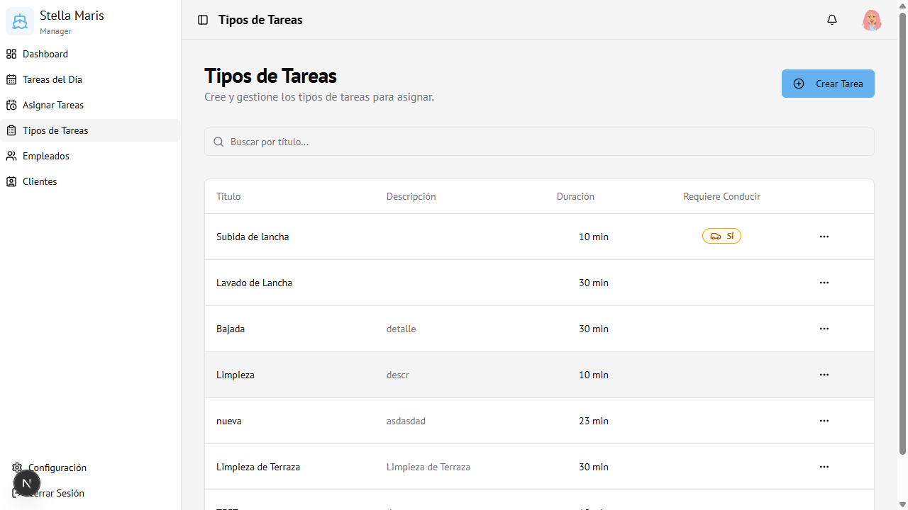
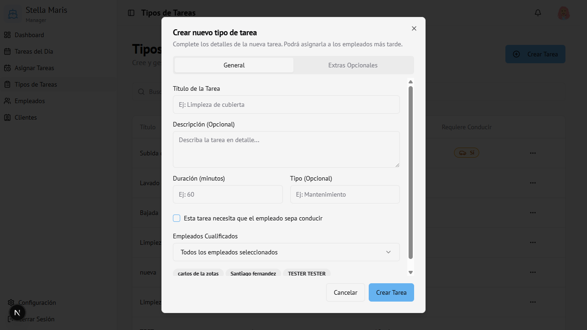

# 04 — Tipos de Tareas

← [Tareas del Día](03-tareas-del-dia.md) | [Índice](00-indice.md) | Siguiente: [Empleados →](05-empleados.md)

---

## Vista general

Aquí se definen los **tipos de tarea** disponibles en el sistema. Estas plantillas son las que luego se usan al asignar trabajo a los empleados.

---

## Crear un nuevo tipo de tarea

1. Hacer clic en **Crear Tarea** (arriba a la derecha)
2. Se abre el formulario de creación

### Pestaña General

| Campo | Obligatorio | Descripción |
|-------|-------------|-------------|
| **Título de la Tarea** | Sí | Nombre que identifica el tipo de tarea (ej: "Bajada de lancha") |
| **Descripción** | No | Detalle adicional de la tarea |
| **Duración (minutos)** | Sí | Tiempo estimado para completarla |
| **Tipo** | No | Categoría libre (ej: "Mantenimiento", "Operativo") |
| **Requiere conducir** | No | Marcar si el empleado debe saber conducir |
| **Empleados Cualificados** | No | Qué empleados pueden realizar esta tarea. Por defecto: todos |

### Pestaña Extras Opcionales

Permite agregar ítems adicionales con precio que se pueden incluir al asignar la tarea.

| Campo | Descripción |
|-------|-------------|
| **Nombre del extra** | Ej: "Nafta", "Aceite" |
| **Precio (AR$)** | Precio unitario (opcional) |

Para agregar un extra: clic en **+ Agregar Extra**
Para eliminar: clic en el ícono de papelera

3. Hacer clic en **Crear Tarea** para guardar

---

## Editar un tipo de tarea

1. En la tabla, hacer clic en los **tres puntos (···)** de la fila
2. Seleccionar **Editar**
3. Modificar los campos necesarios
4. Hacer clic en **Guardar Cambios**

---

## Eliminar un tipo de tarea

1. En la tabla, hacer clic en los **tres puntos (···)**
2. Seleccionar **Eliminar**
3. Confirmar en el diálogo de alerta

> **Atención:** Esta acción no se puede deshacer. Si la tarea tiene asignaciones activas, se recomienda cancelarlas antes de eliminar el tipo.

---

## Buscar una tarea

Usar el campo de búsqueda para filtrar por título.

---

## Acceso

Solo visible para **Administrador**.
Ruta: `/tasks`
