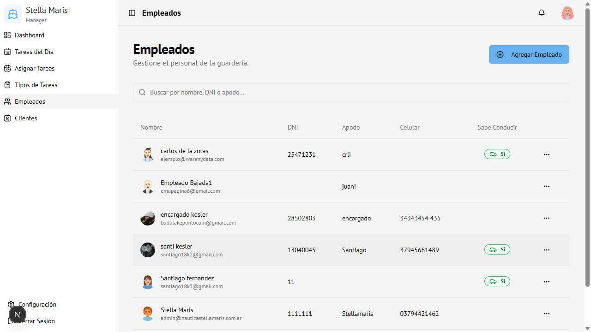
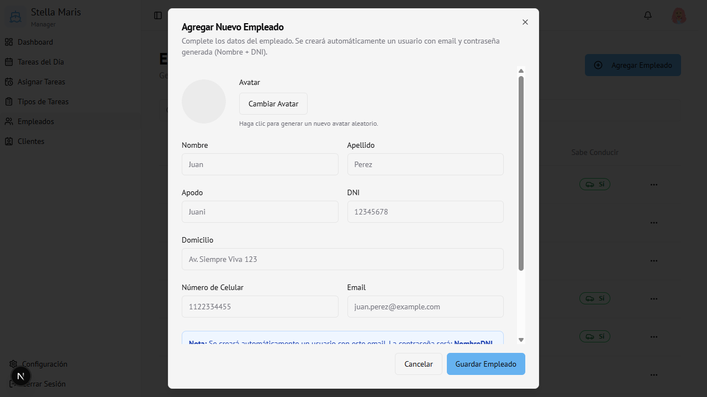

# 05 — Empleados

← [Tipos de Tareas](04-tipos-de-tareas.md) | [Índice](00-indice.md) | Siguiente: [Clientes →](06-clientes.md)

---

## Vista general

Gestión del personal de la guardería. Muestra la lista de empleados con sus datos principales.

La tabla incluye:
- **Avatar** generado automáticamente
- **Nombre completo** y email
- **DNI**
- **Apodo**
- **Celular**
- **Sabe Conducir** — indicador de si puede operar vehículos

---

## Agregar un empleado

1. Hacer clic en **Agregar Empleado** (arriba a la derecha)
2. Se abre el formulario

### Campos del formulario

| Campo | Obligatorio | Descripción |
|-------|-------------|-------------|
| **Avatar** | No | Clic en "Cambiar Avatar" para generar uno aleatorio |
| **Nombre** | Sí | Nombre del empleado |
| **Apellido** | Sí | Apellido del empleado |
| **Apodo** | No | Nombre corto usado internamente |
| **DNI** | Sí | Documento Nacional de Identidad |
| **Domicilio** | No | Dirección del empleado |
| **Número de Celular** | No | Teléfono de contacto |
| **Email** | Sí | Se usa para crear el acceso al sistema |
| **Sabe Conducir** | No | Marcar si puede operar vehículos |
| **Subrol** | Sí | Nivel de acceso: Empleado / Encargado / Admin |

> **Nota:** Al guardar, el sistema crea automáticamente un usuario con el email ingresado. La contraseña inicial es **NombreDNI** (ej: `Juan12345678`). El empleado debe cambiarla desde Configuración.

3. Hacer clic en **Guardar Empleado**

---

## Editar un empleado

1. Hacer clic en los **tres puntos (···)** de la fila
2. Seleccionar **Editar**
3. Modificar los datos
4. Hacer clic en **Guardar Empleado**

---

## Eliminar un empleado

1. Hacer clic en los **tres puntos (···)**
2. Seleccionar **Eliminar**
3. Confirmar en el diálogo de alerta

> **Atención:** Eliminar un empleado no elimina su usuario de acceso. Para revocar el acceso, cambiar el rol o contactar al administrador del sistema.

---

## Buscar empleados

Usar el buscador para filtrar por **nombre**, **DNI** o **apodo**.

---

## Subroles disponibles

| Subrol | Acceso |
|--------|--------|
| **Empleado** | Solo ve sus tareas y calendario |
| **Encargado** | Ve tareas del día (sin alta de clientes) |
| **Admin** | Acceso completo al sistema |

---

## Acceso

Solo visible para **Administrador**.
Ruta: `/employees`
