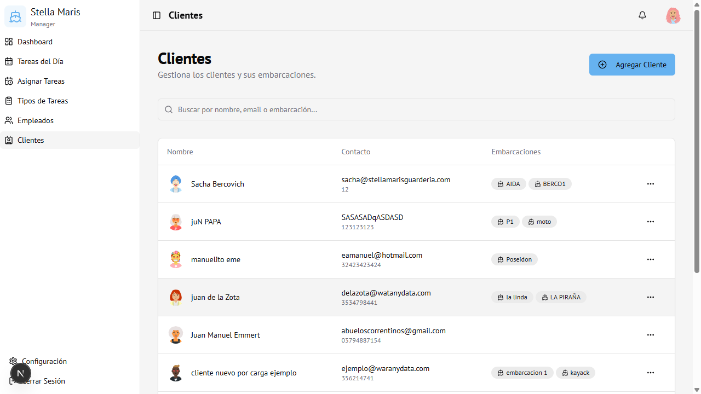
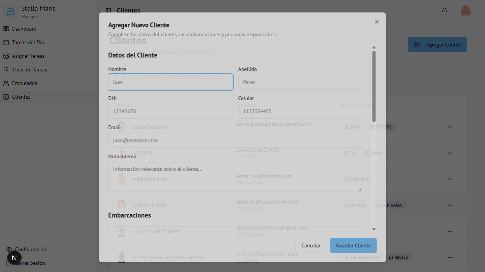

# 06 — Clientes

← [Empleados](05-empleados.md) | [Índice](00-indice.md) | Siguiente: [Asignar Tareas →](07-asignar-tareas.md)

---

## Vista general

Gestión de los clientes de la guardería y sus embarcaciones.

La tabla muestra:
- **Avatar** del cliente
- **Nombre completo**
- **Contacto** — email y teléfono
- **Embarcaciones** — chips con los nombres de las lanchas registradas

---

## Agregar un cliente

1. Hacer clic en **Agregar Cliente** (arriba a la derecha)
2. Se abre el formulario

### Sección: Datos del Cliente

| Campo | Obligatorio | Descripción |
|-------|-------------|-------------|
| **Nombre** | Sí | Nombre del cliente |
| **Apellido** | Sí | Apellido del cliente |
| **DNI** | No | Documento de identidad |
| **Celular** | No | Número de contacto |
| **Email** | No | Correo electrónico |
| **Nota Interna** | No | Observaciones privadas (solo visibles para el admin) |

### Sección: Embarcaciones

Se pueden agregar una o varias embarcaciones al cliente:

| Campo | Descripción |
|-------|-------------|
| **Nombre** | Nombre de la lancha (ej: "La Linda") |
| **Tipo de casco** | Material o modelo del casco |
| **Motor** | Descripción del motor |
| **Número de registro** | Matrícula oficial |
| **Fotos** | Imágenes de la embarcación (opcional) |

Para agregar una embarcación: clic en **+ Agregar Embarcación**
Para eliminar: clic en el ícono de papelera

### Sección: Personas Responsables

Contactos adicionales autorizados por el cliente:

| Campo | Descripción |
|-------|-------------|
| **Nombre y Apellido** | Persona responsable |
| **DNI** | Documento de identidad |
| **Celular** | Teléfono de contacto |

Para agregar: clic en **+ Agregar Responsable**

3. Hacer clic en **Guardar Cliente**

---

## Editar un cliente

1. Hacer clic en los **tres puntos (···)** de la fila
2. Seleccionar **Editar**
3. Modificar los datos (incluyendo embarcaciones y responsables)
4. Hacer clic en **Guardar Cliente**

---

## Eliminar un cliente

1. Hacer clic en los **tres puntos (···)**
2. Seleccionar **Eliminar**
3. Confirmar en el diálogo de alerta

---

## Buscar clientes

Usar el buscador para filtrar por **nombre**, **email** o **nombre de embarcación**.

---

## Acceso

Visible para **Administrador**.
Los **Encargados** pueden ver la lista pero no agregar ni eliminar clientes.
Ruta: `/clients`
