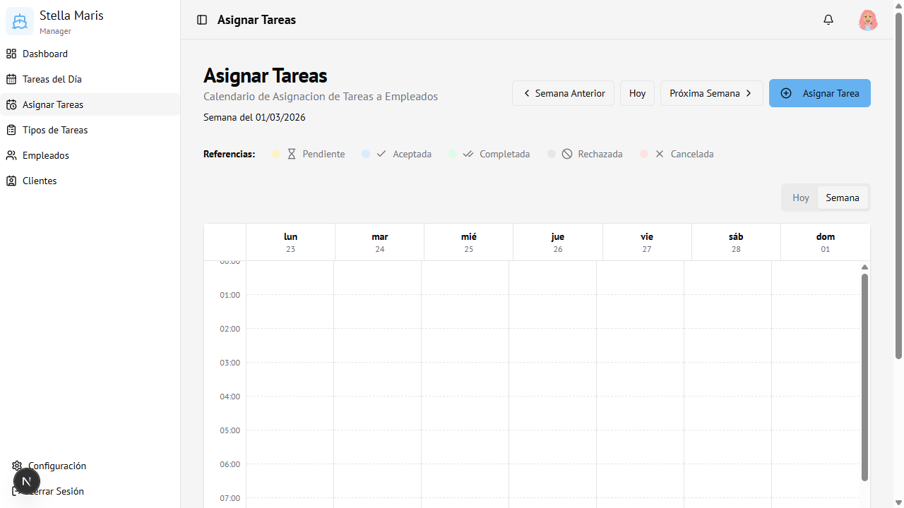

# 07 — Asignar Tareas

← [Clientes](06-clientes.md) | [Índice](00-indice.md) | Siguiente: [Configuración →](08-configuracion.md)

---

## Vista general

Calendario semanal y diario para asignar y visualizar tareas a los empleados.

---

## Modos de vista

| Vista | Descripción |
|-------|-------------|
| **Semana** | Muestra 7 días en columnas, con las tareas como bloques de tiempo |
| **Hoy** | Vista del día actual con mayor detalle de horarios |

Para cambiar entre vistas: botones **Hoy** / **Semana** en la esquina superior derecha del calendario.

---

## Navegar entre semanas

- **← Semana Anterior** — retrocede una semana
- **Hoy** — vuelve a la semana actual
- **Próxima Semana →** — avanza una semana

---

## Referencias de colores (estados)

| Color | Estado |
|-------|--------|
| Amarillo | Pendiente |
| Azul | Aceptada |
| Verde | Completada |
| Gris | Rechazada |
| Rojo | Cancelada |

---

## Crear una nueva asignación

1. Hacer clic en **Asignar Tarea** (arriba a la derecha)
2. Se abre el formulario de asignación

### Campos del formulario

| Campo | Obligatorio | Descripción |
|-------|-------------|-------------|
| **Tipo de Tarea** | Sí | Seleccionar de la lista de tipos creados |
| **Fecha** | Sí | Día en que se realizará |
| **Hora de inicio** | Sí | Hora de comienzo |
| **Hora de fin** | Sí | Hora de finalización (se sugiere según duración del tipo) |
| **Empleado/s** | No | Uno o varios empleados asignados |
| **Estado** | Sí | Estado inicial (por defecto: Pendiente) |
| **Cliente** | No | Cliente al que pertenece la tarea |
| **Embarcación** | No | Lancha específica del cliente |
| **Extras** | No | Ítems adicionales definidos en el tipo de tarea |
| **Observaciones** | No | Notas libres para el empleado |

> **Detección de conflictos:** Si el empleado seleccionado ya tiene otra tarea en ese horario, el sistema muestra una advertencia antes de guardar.

3. Hacer clic en **Guardar** o **Guardar de todas formas** si hay conflicto aceptado

---

## Editar una asignación existente

1. Hacer clic sobre el bloque de tarea en el calendario
2. Se muestra el detalle de la asignación
3. Hacer clic en **Editar** para modificar los datos
4. Guardar los cambios

---

## Eliminar una asignación

1. Hacer clic sobre el bloque de tarea
2. En el detalle, hacer clic en **Eliminar**
3. Confirmar la acción

---

## Acceso

Solo visible para **Administrador**.
Ruta: `/schedule`
