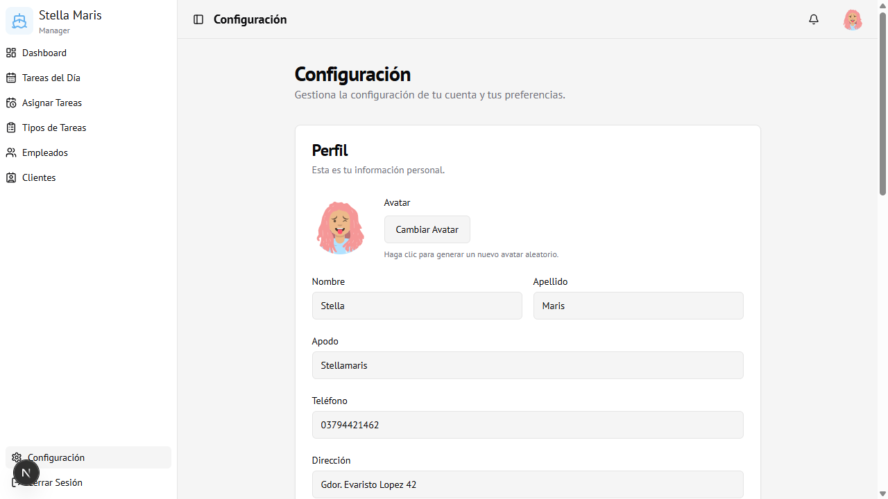

# 08 — Configuración

← [Asignar Tareas](07-asignar-tareas.md) | [Índice](00-indice.md)

---

## Vista general

Pantalla de perfil y preferencias personales. Accesible para todos los usuarios.

---

## Sección: Perfil

Muestra y permite editar los datos personales del usuario logueado.

| Campo | Descripción |
|-------|-------------|
| **Avatar** | Imagen de perfil generada automáticamente. Clic en "Cambiar Avatar" para obtener un nuevo avatar aleatorio |
| **Nombre** | Nombre del usuario |
| **Apellido** | Apellido del usuario |
| **Apodo** | Nombre corto para uso interno |
| **Teléfono** | Número de contacto |
| **Dirección** | Domicilio |

Para guardar los cambios del perfil: hacer clic en **Guardar Perfil**.

---

## Sección: Cambiar Contraseña

Permite actualizar la contraseña de acceso al sistema.

| Campo | Descripción |
|-------|-------------|
| **Contraseña actual** | La contraseña con la que ingresaste |
| **Nueva contraseña** | La nueva contraseña deseada |
| **Confirmar contraseña** | Repetir la nueva contraseña |

Para aplicar el cambio: hacer clic en **Cambiar Contraseña**.

> **Recomendación:** Los empleados nuevos deben cambiar su contraseña inicial (que es **NombreDNI**) en esta sección.

---

## Cerrar Sesión

Desde cualquier pantalla se puede cerrar sesión de dos formas:

1. **Barra lateral izquierda** → botón **Cerrar Sesión** (al pie del menú)
2. **Avatar superior derecho** → menú desplegable → **Cerrar Sesión**

Al cerrar sesión se vuelve a la pantalla de login.

---

## Acceso

Visible para **todos los usuarios** autenticados.
Ruta: `/settings`
