# Manual de Administrador - Stella Maris Manager
## Guía Completa para Administradores

**Versión:** 1.0  
**Fecha:** Diciembre 2025  
**Sistema:** Stella Maris Manager

---

## Tabla de Contenidos

1. [Introducción](#introducción)
2. [Acceso al Sistema](#acceso-al-sistema)
3. [Dashboard](#dashboard)
4. [Tareas del Día](#tareas-del-día)
5. [Asignar Tareas](#asignar-tareas)
6. [Tipos de Tareas](#tipos-de-tareas)
7. [Gestión de Empleados](#gestión-de-empleados)
8. [Gestión de Clientes](#gestión-de-clientes)
9. [Configuración](#configuración)
10. [Notificaciones](#notificaciones)
11. [Preguntas Frecuentes](#preguntas-frecuentes)

---

## 1. Introducción

Este manual está dirigido a **administradores** del sistema Stella Maris Manager. Como administrador, tienes acceso completo a todas las funcionalidades del sistema para gestionar tareas, empleados, clientes y asignaciones.

### Funcionalidades Disponibles para Administradores

- ✅ Ver dashboard con resumen general
- ✅ Gestionar tareas del día
- ✅ Asignar tareas a empleados
- ✅ Crear, editar y eliminar tipos de tareas
- ✅ Gestionar empleados (crear, editar, eliminar)
- ✅ Gestionar clientes y sus embarcaciones
- ✅ Ver y gestionar notificaciones
- ✅ Configurar el sistema

---

## 2. Acceso al Sistema

### 2.1 Iniciar Sesión como Administrador

1. Abre tu navegador web
2. Ingresa la URL del sistema
3. En la pantalla de inicio de sesión:
   - **Email:** Ingresa tu correo de administrador
   - **Contraseña:** Ingresa tu contraseña
   - **Tipo de usuario:** Selecciona **"Administrador"**
4. Haz clic en **"Iniciar Sesión"**

> **Nota:** Si olvidaste tu contraseña o necesitas recuperarla, usa las funciones de recuperación de contraseña de Supabase.

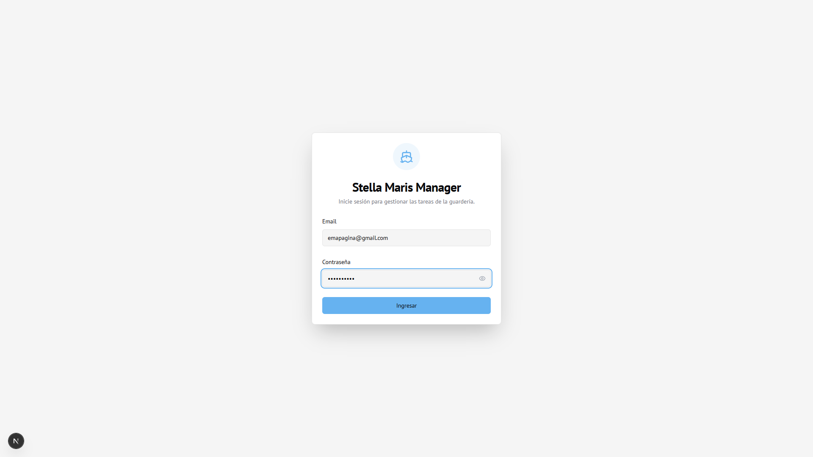

### 2.2 Seguridad

- Nunca compartas tus credenciales de administrador
- Cambia tu contraseña periódicamente
- Cierra sesión al terminar tu trabajo, especialmente en computadoras compartidas

---

## 3. Dashboard

El **Dashboard** es tu pantalla principal donde verás un resumen general del sistema.

### 3.1 Acceso al Dashboard

Una vez que inicias sesión, serás redirigido automáticamente al Dashboard.

### 3.2 Información Mostrada

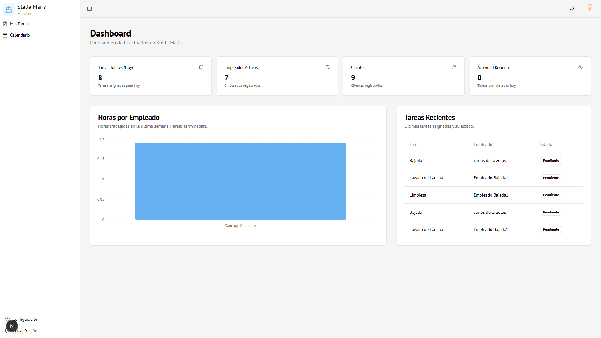

El Dashboard muestra:

- **Resumen de tareas** por estado
- **Estadísticas generales** del sistema
- **Información relevante** sobre empleados y asignaciones

### 3.3 Navegación

Desde el Dashboard puedes acceder a todas las secciones del sistema usando la barra lateral izquierda.

---

## 4. Tareas del Día

La sección **"Tareas del Día"** te permite ver y gestionar todas las tareas asignadas para el día actual.

### 4.1 Acceder a Tareas del Día

1. En la barra lateral, haz clic en **"Tareas del Día"**
2. Verás todas las tareas asignadas para la fecha seleccionada

### 4.2 Funcionalidades Disponibles

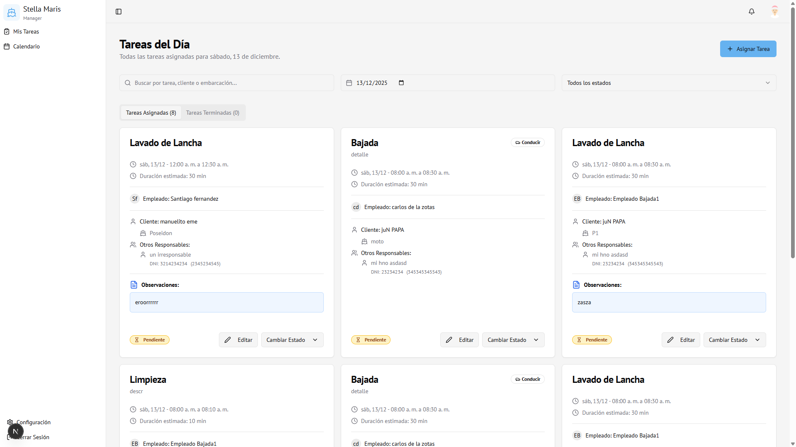

#### Ver Tareas

Las tareas se organizan en pestañas:

- **📋 Tareas Asignadas** - Todas las tareas con estado Pendiente, Aceptada, etc.
- **✅ Tareas Terminadas** - Tareas completadas

#### Buscar Tareas

1. Usa el campo **"Buscar"** en la parte superior
2. Puedes buscar por:
   - Nombre de la tarea
   - Cliente
   - Embarcación
   - Empleado

#### Filtrar por Fecha

1. Haz clic en el **selector de fecha** (icono de calendario)
2. Selecciona la fecha que deseas ver
3. Las tareas se actualizarán automáticamente

#### Filtrar por Estado

1. Usa el **combo de estados** en la parte superior
2. Selecciona el estado deseado:
   - Todo
   - Pendiente
   - Aceptada
   - Terminada
   - Rechazada
   - Cancelada

### 4.3 Editar una Tarea

1. Localiza la tarea que deseas editar
2. Haz clic en el botón **"Editar"** en la tarjeta de la tarea
3. Se abrirá el formulario de edición
4. Realiza los cambios necesarios
5. Haz clic en **"Guardar Cambios"**

### 4.4 Cambiar Estado de una Tarea

1. Localiza la tarea
2. Haz clic en **"Cambiar Estado"**
3. Selecciona el nuevo estado
4. El estado se actualizará inmediatamente

### 4.5 Ver Detalles Completos

1. Haz clic en la tarjeta de la tarea
2. Se mostrará un diálogo con:
   - Información completa de la tarea
   - Cliente y embarcación
   - Empleados asignados
   - Observaciones
   - Extras adicionales

### 4.6 Observaciones

Las observaciones son notas adicionales que puedes agregar a las tareas:

- Se muestran en la tarjeta con un ícono 📄
- Son visibles tanto para administradores como para empleados
- Puedes editarlas al editar la tarea

---

## 5. Asignar Tareas

La sección **"Asignar Tareas"** te permite crear nuevas asignaciones de tareas a empleados.

### 5.1 Acceder a Asignar Tareas

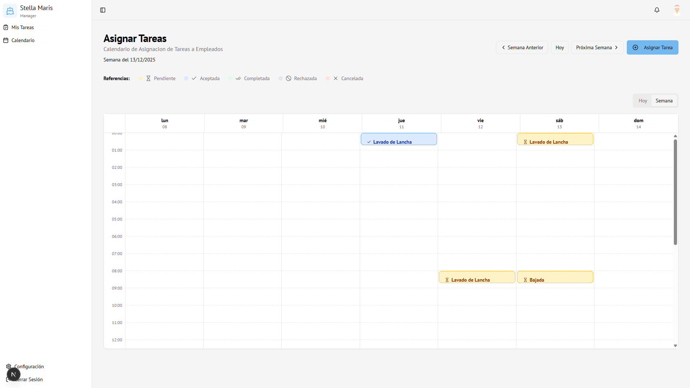

1. En la barra lateral, haz clic en **"Asignar Tareas"**
2. Verás un calendario con vista semanal

### 5.2 Crear una Nueva Asignación

#### Desde "Tareas del Día"

1. Haz clic en el botón **"Asignar Tarea"** en la parte superior
2. Se abrirá el formulario de asignación

#### Desde "Asignar Tareas" (Calendario)

1. Haz clic en el **día y hora** donde deseas asignar la tarea
2. Se abrirá el formulario de asignación

### 5.3 Formulario de Asignación

El formulario tiene dos pestañas: **"General"** y **"Extras"** (si la tarea tiene extras).

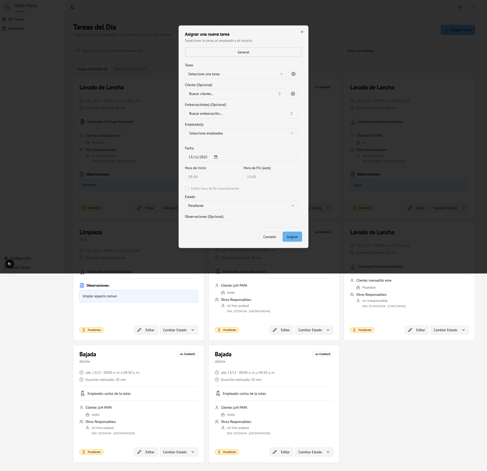

#### Pestaña General

**Campos obligatorios:**

1. **Tarea** ⭐
   - Selecciona el tipo de tarea de la lista desplegable
   - Puedes crear una nueva tarea con el botón "+" si no existe

2. **Empleado(s)** ⭐
   - Selecciona uno o más empleados del menú desplegable
   - Puedes seleccionar múltiples empleados para la misma tarea

3. **Fecha** ⭐
   - Selecciona la fecha de la asignación

4. **Hora de Inicio** ⭐
   - Ingresa la hora de inicio (formato HH:MM)

**Campos opcionales:**

5. **Cliente**
   - Busca y selecciona un cliente usando el campo de búsqueda
   - Puedes escribir nombre, DNI o email para buscar
   - Si no existe, puedes crear uno nuevo con el botón "+"

6. **Embarcación(es)**
   - Solo aparece si seleccionaste un cliente
   - Busca y selecciona una o más embarcaciones
   - Puedes buscar por nombre, patente o tipo de casco

7. **Hora de Fin**
   - Se calcula automáticamente según la duración de la tarea
   - Puedes marcarlo como manual para editarlo

8. **Estado**
   - Selecciona el estado inicial (por defecto: Pendiente)

9. **Observaciones**
   - Campo de texto libre para notas adicionales
   - Visible tanto para administradores como empleados

#### Pestaña Extras (si aplica)

Si la tarea tiene extras disponibles:

1. Selecciona los extras deseados
2. Ingresa la cantidad para cada extra
3. El costo total se calcula automáticamente

### 5.4 Búsqueda de Clientes y Embarcaciones

El sistema cuenta con búsqueda avanzada:

#### Buscar Cliente

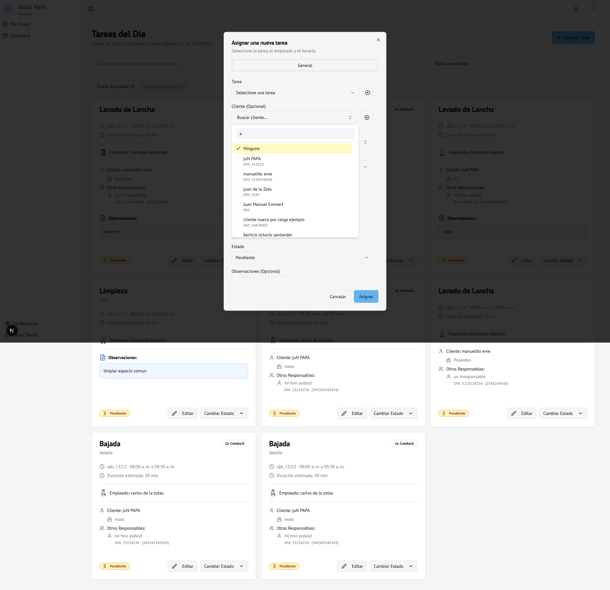

- Escribe en el campo "Buscar cliente..."
- Busca por:
  - Nombre
  - Apellido
  - DNI
  - Email
- Los resultados se filtran en tiempo real
- Al seleccionar un cliente, se limpia el filtro y se muestran todas las opciones

#### Buscar Embarcación

- Si hay un cliente seleccionado, solo muestra sus embarcaciones
- Si no hay cliente, muestra todas las embarcaciones
- Busca por:
  - Nombre de la embarcación
  - Número de registro/patente
  - Nombre del cliente
  - Tipo de casco

### 5.5 Detección de Conflictos

El sistema detecta automáticamente conflictos de horarios:

- Si un empleado ya tiene una tarea en el mismo horario
- Te mostrará un diálogo de confirmación
- Puedes:
  - **Cancelar** y ajustar los horarios
  - **Continuar** con el conflicto (no recomendado)

### 5.6 Guardar la Asignación

1. Completa los campos obligatorios
2. Revisa toda la información
3. Haz clic en **"Asignar"**
4. El botón cambiará a "Guardando..." y se deshabilitará para prevenir envíos múltiples
5. La tarea se creará y notificará automáticamente a los empleados asignados

### 5.7 Restricciones del Formulario

- **No se puede cerrar haciendo clic fuera** - Solo se puede cerrar con:
  - Botón "Cancelar"
  - Botón "X" (cerrar)
  - Tecla Escape
- **No se pueden crear múltiples tareas** - El botón se deshabilita durante el guardado

---

## 6. Tipos de Tareas

La sección **"Tipos de Tareas"** te permite gestionar los diferentes tipos de tareas que se pueden asignar.

### 6.1 Acceder a Tipos de Tareas

1. En la barra lateral, haz clic en **"Tipos de Tareas"**
2. Verás una tabla con todos los tipos de tareas existentes

### 6.2 Ver Tipos de Tareas

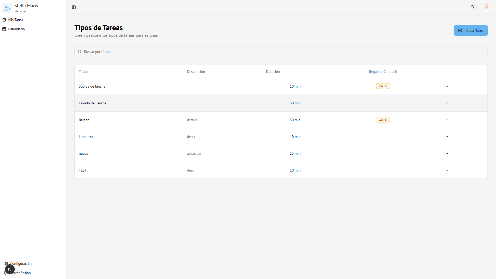

La tabla muestra:

- **Título** - Nombre de la tarea
- **Descripción** - Detalles de la tarea
- **Duración** - Tiempo estimado de ejecución
- **Habilidades requeridas** - Empleados calificados
- **Acciones** - Botones para editar o eliminar

### 6.3 Crear un Nuevo Tipo de Tarea

1. Haz clic en el botón **"Agregar Tarea"** en la parte superior
2. Se abrirá el formulario de creación
3. Completa los campos:

   **Campos obligatorios:**

   - **Título** ⭐ - Nombre descriptivo de la tarea
   - **Descripción** ⭐ - Detalles sobre qué implica la tarea
   - **Duración estimada** ⭐ - Tiempo en horas (ej: 2.5)

   **Campos opcionales:**

   - **Empleados calificados** - Selecciona qué empleados están calificados para esta tarea
   - **Extras** - Agrega servicios adicionales con precio (si aplica)
   - **Tipo de tarea** - Categoría opcional

4. Haz clic en **"Guardar"**

### 6.4 Editar un Tipo de Tarea

1. En la tabla, localiza la tarea que deseas editar
2. Haz clic en los **tres puntos** (⋮) en la columna de acciones
3. Selecciona **"Editar"**
4. Modifica los campos necesarios
5. Haz clic en **"Guardar Cambios"**

### 6.5 Eliminar un Tipo de Tarea

1. En la tabla, localiza la tarea que deseas eliminar
2. Haz clic en los **tres puntos** (⋮)
3. Selecciona **"Eliminar"**
4. Confirma la eliminación en el diálogo

> **⚠️ Advertencia:** Solo puedes eliminar tipos de tareas que no tienen asignaciones activas. Si una tarea tiene asignaciones, primero deberás eliminar o completar todas sus asignaciones.

### 6.6 Empleados Calificados

Al crear o editar una tarea, puedes especificar qué empleados están calificados:

- Si especificas empleados calificados, solo esos empleados aparecerán al asignar esta tarea
- Si no especificas, todos los empleados estarán disponibles

---

## 7. Gestión de Empleados

La sección **"Empleados"** te permite gestionar toda la información de los empleados del sistema.

### 7.1 Acceder a Empleados

1. En la barra lateral, haz clic en **"Empleados"**
2. Verás una tabla con todos los empleados

### 7.2 Ver Lista de Empleados

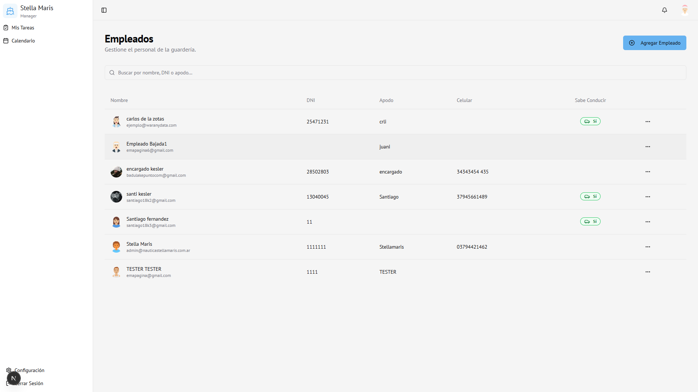

La tabla muestra:

- **Nombre completo** con avatar
- **DNI**
- **Apodo/Nickname**
- **Celular**
- **Sabe conducir** (Sí/No)
- **Acciones** - Menú con opciones

### 7.3 Buscar Empleados

Usa el campo de búsqueda en la parte superior para buscar por:

- Nombre
- Apellido
- DNI
- Apodo

### 7.4 Crear un Nuevo Empleado

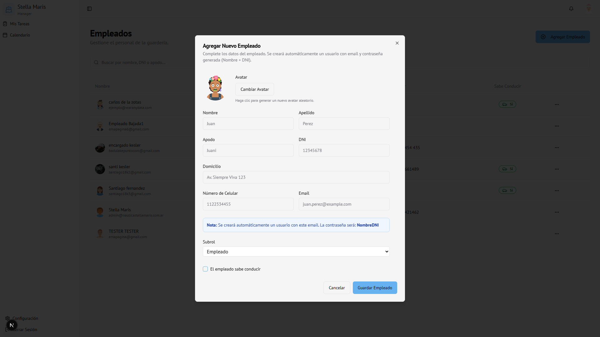

1. Haz clic en el botón **"Agregar Empleado"**
2. Se abrirá el formulario de creación

**Campos del formulario:**

- **Nombre** ⭐ (obligatorio)
- **Apellido** ⭐ (obligatorio)
- **Apodo/Nickname** (opcional)
- **DNI** (opcional)
- **Dirección** (opcional)
- **Celular** (opcional)
- **Email** ⭐ (obligatorio) - Se usará para el login
- **Sabe conducir** - Checkbox
- **Subrol** - Solo visible para administradores:
  - Empleado
  - Encargado
  - Admin

3. Haz clic en **"Guardar"**

> **Nota:** Al crear un empleado, el sistema automáticamente:
> - Crea una cuenta de usuario con el email proporcionado
> - Genera una contraseña temporal
> - Asigna un avatar automático

### 7.5 Editar un Empleado

1. En la tabla, localiza el empleado
2. Haz clic en los **tres puntos** (⋮)
3. Selecciona **"Editar"**
4. Modifica los campos necesarios
5. Haz clic en **"Guardar Cambios"**

> **Importante:** 
> - El email NO se puede cambiar después de crear el empleado
> - El subrol solo puede ser modificado por administradores principales

### 7.6 Ver Tareas de un Empleado

1. En la tabla, haz clic en los **tres puntos** (⋮)
2. Selecciona **"Ver Tareas"**
3. Se mostrará un diálogo con todas las tareas asignadas a ese empleado

### 7.7 Eliminar un Empleado

1. En la tabla, haz clic en los **tres puntos** (⋮)
2. Selecciona **"Eliminar"**
3. Confirma la eliminación

> **⚠️ Advertencia:** Eliminar un empleado también eliminará su cuenta de usuario y acceso al sistema. Esta acción no se puede deshacer.

### 7.8 Subroles de Empleados

El sistema tiene tres subroles:

- **Empleado** - Acceso estándar (Mis Tareas, Calendario)
- **Encargado** - Similar a empleado, pero con algunas restricciones en edición
- **Admin** - Acceso completo de administrador

---

## 8. Gestión de Clientes

La sección **"Clientes"** te permite gestionar clientes y sus embarcaciones.

### 8.1 Acceder a Clientes

1. En la barra lateral, haz clic en **"Clientes"**
2. Verás una tabla con todos los clientes

### 8.2 Ver Lista de Clientes

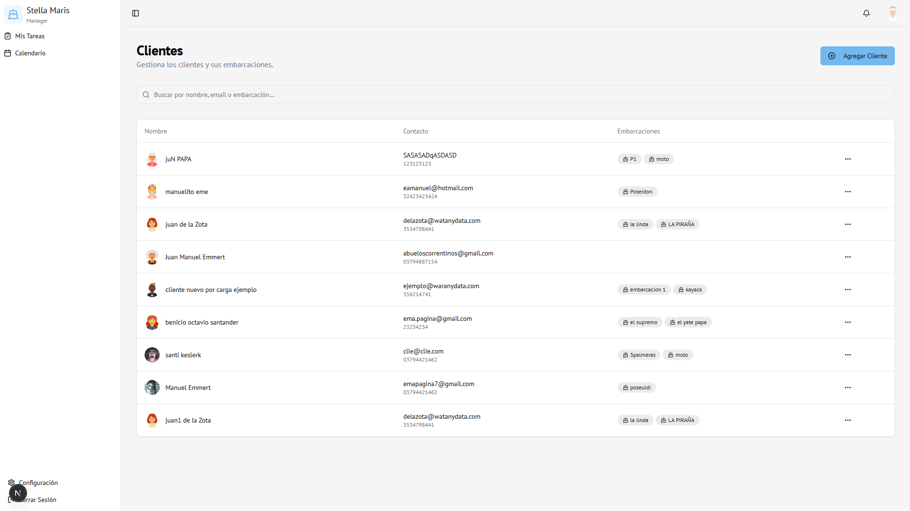

La tabla muestra:

- **Nombre completo** con avatar
- **Contacto** - Email y teléfono
- **Embarcaciones** - Lista de embarcaciones del cliente
- **Acciones** - Menú con opciones

### 8.3 Buscar Clientes

Usa el campo de búsqueda para buscar por:

- Nombre
- Apellido
- Email
- DNI
- Nombre de embarcación

### 8.4 Crear un Nuevo Cliente

1. Haz clic en el botón **"Agregar Cliente"**
2. Se abrirá el formulario de creación

**Sección: Datos del Cliente**

- **Nombre** ⭐ (obligatorio)
- **Apellido** ⭐ (obligatorio)
- **DNI** (opcional)
- **Celular** (opcional)
- **Email** (opcional)
- **Nota Interna** (opcional) - Solo visible para administradores

**Sección: Embarcaciones**

- Puedes agregar una o más embarcaciones:
  - **Nombre** - Nombre de la embarcación
  - **Patente** - Número de registro
  - **Tipo de Casco** - Tipo de embarcación
  - **Motor** - Información del motor
  - **Foto** (opcional) - Subir foto de la embarcación

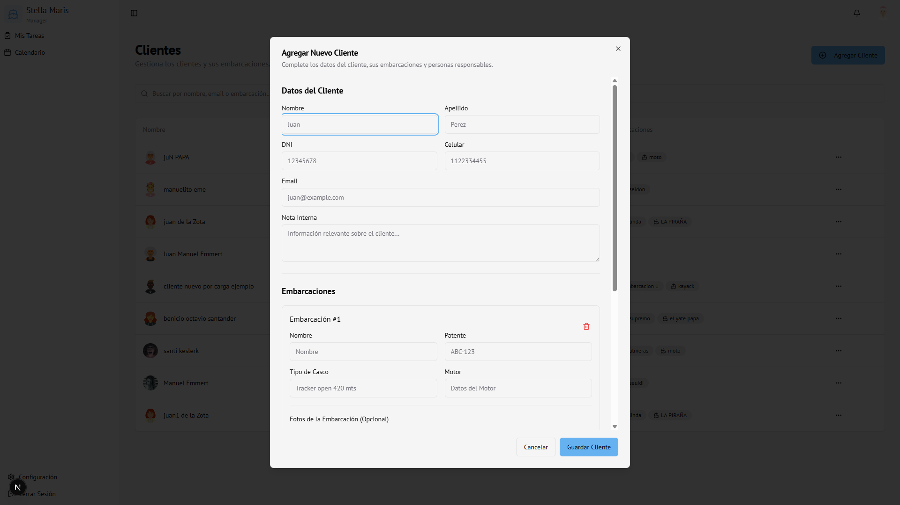

**Sección: Otro Responsable**

- Puedes agregar responsables adicionales:
  - Nombre y Apellido
  - DNI
  - Celular

3. Haz clic en **"Guardar Cambios"**

### 8.5 Editar un Cliente

1. En la tabla, haz clic en los **tres puntos** (⋮)
2. Selecciona **"Editar"**
3. Modifica los campos necesarios
4. Haz clic en **"Guardar Cambios"**

### 8.6 Gestionar Embarcaciones de un Cliente

Al editar un cliente, puedes:

- **Agregar embarcación:** Haz clic en "Agregar Embarcación"
- **Eliminar embarcación:** Haz clic en el botón de eliminar (🗑️) de la embarcación
- **Subir foto:** Haz clic en "Agregar Foto" en cada embarcación

### 8.7 Gestionar Responsables

Al editar un cliente, puedes:

- **Agregar responsable:** Haz clic en "Agregar Responsable"
- **Eliminar responsable:** Haz clic en el botón de eliminar del responsable

### 8.8 Eliminar un Cliente

1. En la tabla, haz clic en los **tres puntos** (⋮)
2. Selecciona **"Eliminar"**
3. Confirma la eliminación

> **⚠️ Advertencia:** Eliminar un cliente también eliminará todas sus embarcaciones y datos asociados. Esta acción no se puede deshacer.

---

## 9. Configuración

La sección **"Configuración"** te permite gestionar tu perfil y preferencias.

### 9.1 Acceder a Configuración

1. Haz clic en tu **avatar o nombre** en la barra superior
2. Selecciona **"Configuración"**

### 9.2 Información del Perfil

Puedes ver:

- Tu nombre completo
- Tu correo electrónico
- Tu rol (Administrador)
- Tu subrol (si aplica)
- Tu avatar

### 9.3 Cambiar Contraseña

Para cambiar tu contraseña, usa las funciones de recuperación de contraseña de Supabase o contacta al administrador del sistema.

---

## 10. Notificaciones

### 10.1 Ver Notificaciones

1. Haz clic en el **icono de campana** (🔔) en la barra superior
2. Se abrirá un panel con todas las notificaciones

### 10.2 Tipos de Notificaciones

Como administrador recibirás notificaciones cuando:

- ✉️ Un empleado cambie el estado de una tarea
- ✉️ Haya cambios importantes en asignaciones
- ✉️ Eventos relevantes del sistema

### 10.3 Configurar Notificaciones

Las notificaciones se configuran automáticamente. Puedes revisarlas desde el panel de notificaciones.

---

## 11. Preguntas Frecuentes

### ¿Cómo asigno una tarea a múltiples empleados?

En el formulario de asignación, el campo "Empleado" permite seleccionar múltiples empleados. Cada empleado recibirá una notificación individual.

### ¿Qué pasa si un empleado rechaza una tarea?

Cuando un empleado rechaza una tarea, recibirás una notificación. Puedes entonces reasignar la tarea a otro empleado o ajustar los detalles.

### ¿Puedo editar una tarea después de asignarla?

Sí, puedes editar cualquier tarea desde la sección "Tareas del Día". Los empleados serán notificados de los cambios relevantes.

### ¿Cómo funcionan los conflictos de horarios?

El sistema detecta automáticamente si un empleado ya tiene una tarea en el mismo horario. Te mostrará una advertencia, pero puedes continuar si es necesario.

### ¿Puedo eliminar un tipo de tarea que ya tiene asignaciones?

No, primero debes eliminar o completar todas las asignaciones de ese tipo de tarea antes de poder eliminarla.

### ¿Cómo busco clientes o embarcaciones rápidamente?

Usa los campos de búsqueda que aparecen en los combos. Puedes buscar por nombre, DNI, email, patente, etc. La búsqueda se actualiza en tiempo real.

### ¿Qué es un "encargado"?

Un encargado es un subrol de empleado con algunas restricciones adicionales. Pueden ver tareas pero tienen limitaciones en edición de ciertos elementos.

### ¿Puedo cambiar el email de un empleado?

No, el email no se puede cambiar después de crear el empleado, ya que se usa como identificador único para el login.

### ¿Cómo funcionan las observaciones?

Las observaciones son notas libres que puedes agregar a cualquier asignación. Son visibles tanto para administradores como para empleados y pueden ser útiles para instrucciones especiales.

### ¿Qué pasa si olvido cerrar el formulario de asignación?

El formulario no se puede cerrar haciendo clic fuera. Debes usar el botón "Cancelar", "X" o la tecla Escape. Esto previene cierres accidentales.

---

## 12. Consejos y Mejores Prácticas

### Al Asignar Tareas

- ✅ Revisa los conflictos de horarios antes de guardar
- ✅ Completa las observaciones cuando sea necesario
- ✅ Selecciona empleados calificados para la tarea
- ✅ Verifica que el cliente y embarcación estén correctos

### Al Gestionar Empleados

- ✅ Asegúrate de que el email sea correcto (no se puede cambiar después)
- ✅ Asigna subroles apropiados según las responsabilidades
- ✅ Mantén la información de contacto actualizada

### Al Gestionar Clientes

- ✅ Agrega todas las embarcaciones del cliente
- ✅ Incluye fotos de las embarcaciones cuando sea posible
- ✅ Agrega responsables adicionales si es necesario

### Seguridad

- ✅ Cierra sesión al terminar tu trabajo
- ✅ No compartas tus credenciales
- ✅ Cambia tu contraseña periódicamente

---

**Fin del Manual de Administrador**

*Última actualización: Diciembre 2025*

